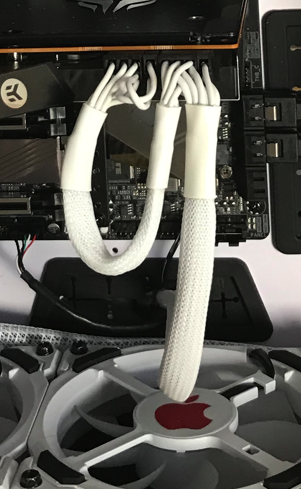

# Side Compartment

## Monitoring and Control

To fasten all the different components which need to go into the side compartment I went for magnet m4 compatible "feet".

I added them to all of the components and put them in a place already, needing afterwards to check if they are in the right position based on cable length.

During the time I was waiting for the sata power extension and a molex splitter I started laying out the cables and connecting all the parts. During this I moved some components around.

I also documented the everything and labeled the cables a little bit to have it afterwards easier to figure out which connection is which. That should be prove valuable during configuration of the system in the Aquasuite.

## Power Cables

The PSU comes with white cables. Unfortunately those are not just normal white cables with combs but cables put into round cable sleeves. And the cables for the GPU are even a Y-splitted cable at the end.

That doesn't really look that nice for the GPU and mainboard.

As the next project will be customised cables I won't pay for additional cables from CableMod, I will have to live with it.

## Spaghetti \(or cable management\)

I then started laying the cables in streams, fixating them a little before I started to plug all of the parts together.

I needed to reroute some cables but it became cleaner and clear very fast. I then started fixating the cables in their intended places. As it is still a lot of cables it is not so clean anymore as before without them.

It is almost even getting to the limit of space I have in the case, which is also caused by using the magnetic feet which raise the components a little and I don't route any cable below them.

On the other-side I wouldn't know how I would have managed this all without those feet.

A quick run without pump and motherboard did at least show that the LaserShow and Windtunnel works :-\)

With sound and bling bling



And now back to the [Main Compartment.](main-compartment.md#filling-of-the-tubes)

