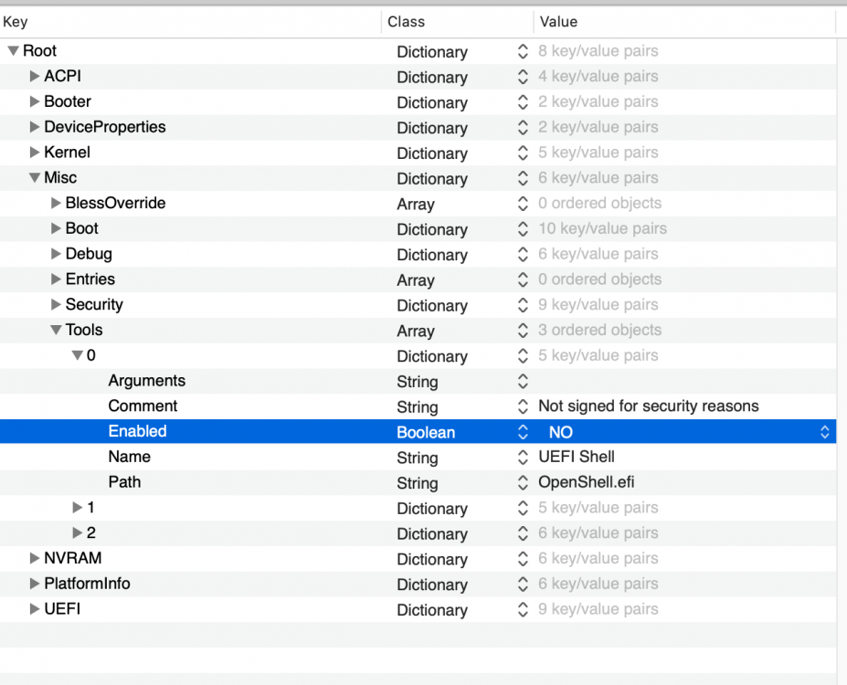

# Bios Configuration Guide

This chapter is about Bios Configuration. I did use the profile from AudioGod which also disables MSR directly but there are some changes I wanted and needed to do.

[Get the necessary files](../this-and-that/resources.md)


If you can't boot into the bios anymore after making changes and see a weird Windows 7 or so boot screen which then boots into your Windows 10 you need to clear the bios, load the profile again and Disable the Above 4GB Decoding which is enabled in AudioGod's profile. After that save your profile again.


## Flashing the Bios

Flashing the bios nowadays is easy and with the Aorus Master even pain-free as it has a second bios to fall back to if you brick your primary.

Unzip the Bios and put the contents on a with FAT32 formatted USB stick \(max size of FAT32 is 4 GB so a small USB stick will be fine\).

Unzip the MSR Unlock Profile from AudioGod and put it on the USB stick too.

Boot into the Bios and select Q-Flash, than create a backup of your bios on the USB stick which has the new Bios.

After that flash the Bios with the new version.

Reboot

## Applying the Profile

So if you didn't brick your Bios in the first step you should now have a bios with version F11c.

Now comes the MSR unlock which is necessary to store the NVM data which is required by OpenCore \(or Clover\) to store some config data. BTW: also macOS uses it to store information, so you either need to emulate it or unlock it. Unlocking is the better option.


Keep in mind that if you clear your CMOS or load the default of the bios the MSR unlock will be gone. You will then need to apply the profile again before booting into macOS. And of course, the profile will not work with any other Bios version than F11c


So boot into Bios and load the custom profile from the stick.

Than 

* Disable Above 4G Decoding
* Disable Internal Graphics Card \(if you are using a iMacPro1,1 version of the Build\)
* Set Aperture Size to 512 MG
* Make changes to the memory profile if required
* Disable CSM if you are using a Liquid Devil like I do!

Save Bios configuration

Reboot

Go into Bios

Save the new profile.


The normal profile save will save it into an area of the Bios, which means that if you switch bios your profile will be gone. So also save the profile to the USB stick.


## Checking the MSR Unlock

So how do you know if MSR is unlocked?

Well... everything works, as easy as that 😀

But to make sure there are 2 ways I know of. 

### Using Opencore Shell

While on OpenCore Boot Picker, press space and select “Modified GRUB Shell”

then type:

setup\_var\_3 0x5C1

and press enter.

If it returns 0x00 then it is indeed unlocked.


By default, the Modified GRUB Shell is disabled even when you press SPACE while on the OpenCore Boot Picker.


To enable the Modified GRUB Shell you need to edit the config.plist



### Using Hackintool in macOS

Another option is to use Hackintool.

use Hackintool&gt;Utilities&gt;Click Get AppleIntelInfo button at the bottom left and look for:

```text
MSR_PMG_CST_CONFIG_CONTROL........(0xE2) : 0x7E000008
------------------------------------------
 - I/O MWAIT Redirection Enable......... : 0 (not enabled)
 - CFG Lock............................. : 0 (MSR not locked)
```


