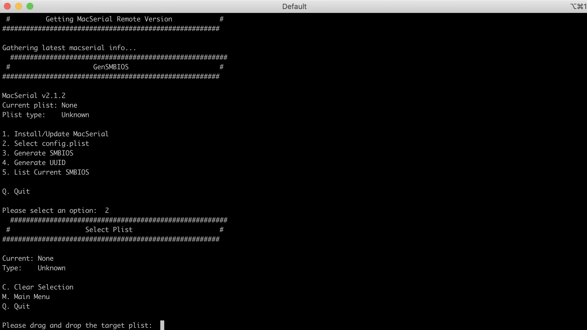
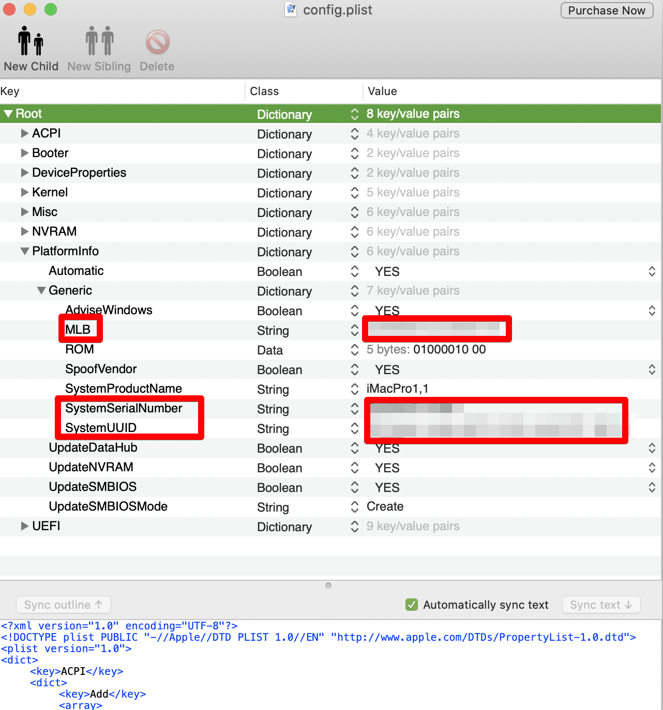

# Bootstick macOS Catalina 10.15.4

And so it begins.

Like before grab [all the stuff ](../../this-and-that/resources.md)you need before proceeding \(which also means the [Bios\)](../bios-configuration-guide.md)

## Creating the Bootstick

There are several ways to create a bootstick for macOS installation. As I have an old High Sierra Hackintosh, kept back in the dark ages by nVidia, I was able to use Tinu.


Tinu 3.0 BETA 2 \(68\) will not work in macOS Catalina [https://github.com/ITzTravelInTime/TINU/issues/14](https://github.com/ITzTravelInTime/TINU/issues/14)


You can download the macOS ISO via the AppStore or you can use [gibMacOS](https://github.com/corpnewt/gibMacOS) and put it somewhere. You then need to point Tinu to the correct location.

After you created the bootstick you then need to mount the EFI partition, either with Tinu, Clover Configurator, ESP Mounter Pro, [MountEFI](https://github.com/Andrej-Antipov/MountEFI) or other.

Unpack the OpenCore zip from AudioGod \(I did use version OpenCore 058 Z390 Master 1,1 040520 \) and copy the EFI folder to a save place.

Duplicate the config.plist file in /EFI/OC

Rename the duplicated one into something like config.plist\_org

Run GENSMBIOS and install MacSerial if necessary


This will generate unique information for your install which is required to make iMessage and other Apple products work.


Link to config.plist from open core

Generate SMBIOS using iMacPro1,1


You can check your SerialNumber on [https://checkcoverage.apple.com/](https://checkcoverage.apple.com/) 

You should get an error saying that the SerialNumber does NOT exist. If it does exist you need to generate a new SerialNumber


Generate UUID

quit GenSMBIOS

You can use PlistEditPro to check the values.

Also change the following Value in Root/NVRAM/Add/7c…..82/

prev-lang:kbd 656E2D55 533A30


This can fix an issue where the install process is in russian when you are not looking.


Create a Readme file inside the EFI folder with information what you did install with this EFI folder, like OC version etc. 

Duplicate the config.plist file and name it like config.plist\_date\_time

Copy the EFI folder on to the EFI Partition of your BootStick.

You are done.


I also found some interesting approaches to keep track of the EFI folder in git which I describe [a little bit later](../../this-and-that/tracking-efi-folder-in-git.md).


