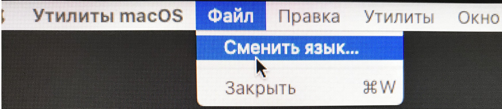
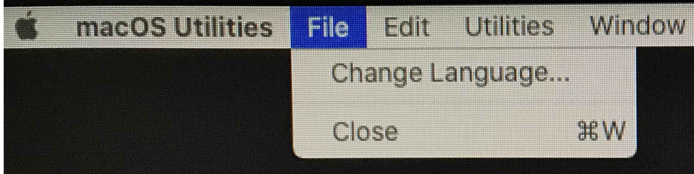

# Installing macOS Catalina

At least with the boot stick. Now for the spicy part. 

## The installation

Ok, not that big of a problem really except with the strange quirk that the installation might start in Russian.

Boot from the USB Stick and Select **Install macOS Catalina \(external\)**

If you get a Russian interface change the language as I show in the pictures or try to use the **back** key to get to a selection screen.


Don't go ahead even it the tools will change to English. The installation under the hood will still use Russian and you will end up with Russian partition names and logs. 


Create a partition for the installation via the DiskUtility, choose APFS with GUID. This will be the **Partition Name** afterward being used to select in the boot picker and as the name for your Hackintosh.

After creating the partition you can then install Catalina. The installation is really smooth but requires several reboots so you should sit around and wait otherwise you keep up ending in Windows 10.

Remember to keep booting from the USB Stick, select **macOS Installer** and not Install macOS Catalina

Remember to keep booting from the USB Stick, select the **Partition Name** which you did create before now

Keep on installing.

If you want to test the install DON’T enter your iCloud Data, just skip that part. I always make sure everything works before I add the iCloud Information.

After adding the iCloud Information you can test iMessage and Facetime.

You are done.

