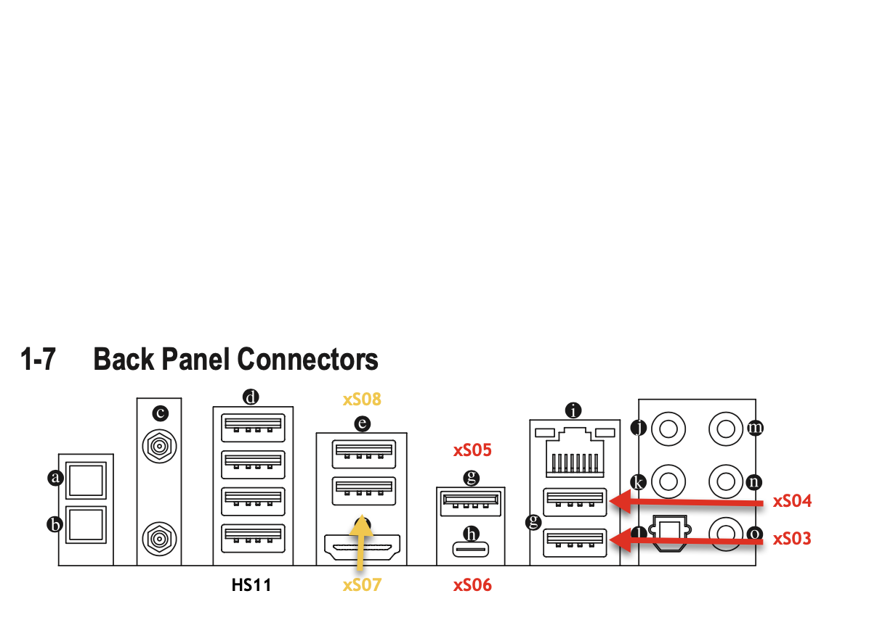

# macOS Catalina and USB - USB Maps

The number of USB ports available in macOS is always weird. And we talk here about the USB ports build into the hardware directly and not any other ports added by hubs. Oh, and btw the limit is 15.

For a more detailed read, you can take a look in the OpenCore documentation [here](https://dortania.github.io/USB-Map-Guide/) or take a look into a lot of the Hackintosh forums which will have threads that will talk you through creating a USB map file, for example the [The New Beginner's Guide to USB Port Configuration](https://www.tonymacx86.com/threads/the-new-beginners-guide-to-usb-port-configuration.286553/) .

## USB Port Map

I have taken the information from [cmer's post on github](https://github.com/cmer/gigabyte-z390-aorus-master-hackintosh/blob/master/USB_MAP.md) which did a superb job.

* **HS01/SS01:** Front USB-C
* **HS02/SS02:** Unknown
* **HS03/SS03:** Rear USB 3.1 \(red, second from Ethernet\)
* **HS04/SS04:** Rear USB 3.1 \(red, next to Ethernet\)
* **HS05/SS05:** Rear USB 3.1 \(red, next to USB-C\)
* **HS06/SS06:** Rear USB-C
* **HS07/SS07:** Rear USB 3.0 \(yellow\) - next to HDMI
* **HS08/SS08:** Rear USB 3.0 \(yellow\)
* **HS09/SS09:** Front USB 3.0 \#1
* **HS10/SS10:** Front USB 3.0 \#2
* **HS11:** Rear USB 2 \(all ports\)
* **HS12:** Internal USB2 \(not used\)
* **HS13:** Internal USB2
* **HS14:** Bluetooth/Wifi
* **USR1:** Unknown
* **USR2:** Unknown

I had some discussion with [Audiogod about which ports he did include in his USBPorts.kext](https://www.insanelymac.com/forum/topic/340936-audiogods-aorus-z390-master-patched-dsdt-efi-for-catalina-mini-guide-and-discussion/?do=findComment&comment=2723072) which shows I still need to learn a lot.


Keep in mind that SSxx are USB3 ports and HSxx are the USB2 ports.


But by looking into the info.plist file of the USBPorts.kext you will see the following

So the following Ports are enabled:

* **SS01:** Front USB-C
* **HS03/SS03:** Rear USB 3.1 \(red, second from Ethernet\)
* **HS04/SS04:** Rear USB 3.1 \(red, next to Ethernet\)
* **SS05:** Rear USB 3.1 \(red, next to USB-C\)
* **SS06:** Rear USB-C
* **HS07/SS07:** Rear USB 3.0 \(yellow\) - next to HDMI
* **HS08/SS08:** Rear USB 3.0 \(yellow\)
* **HS09/SS09:** Front USB 3.0 \#1
* **HS10/SS10:** Front USB 3.0 \#2
* **HS11:** Rear USB 2 \(all ports\)
* **HS13:** Internal USB2

