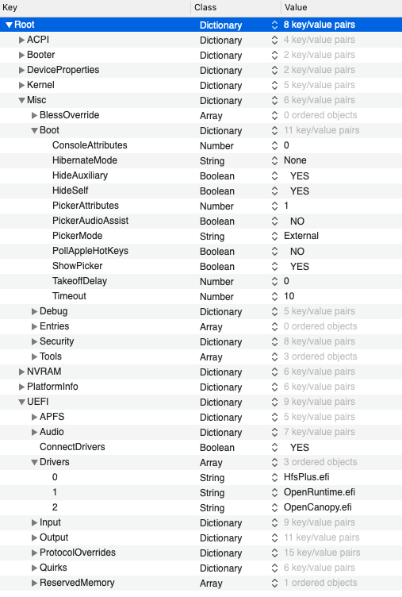
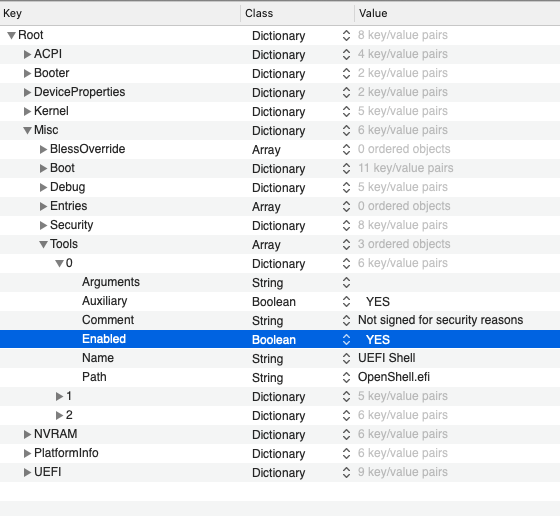

# Tweaking OpenCore

The ZIP from AudioGod has all the information and parts you need to get the hackintosh up and running.

But there is always room for tinkering.

## Making OpenCore fancy

This information here is based on the article from [dortania](https://dortania.github.io/OpenCore-Desktop-Guide/extras/gui.html#setting-up-opencores-gui).

The EFI folder already contains the OpenCanopy.efi file and the needed resources so there is nothing to do there.

The only things which need to be changed is the configuration.

Misc -&gt; Boot -&gt; PickerMode: External

Misc -&gt; Boot -&gt; PickerAttributes:1 

| PickerAttributes | Description |
| :--- | :--- |
| 1 | Enables VolumeIcon.icns reading off the drive, this is how macOS installer icons work  |
| 0x0008 | This is another value which allows for alternative icons, such as the legacy GUI found on legacy Macs |
| 0x0009 |  both legacy GUI and custom drive icons |

More information about PickerAtrributes is available in the [Configuration.pdf](https://github.com/acidanthera/OpenCorePkg/blob/master/Docs/Configuration.pdf)

UEFI -&gt; Drivers and add OpenCanopy.efi

## Enabling OpenCore Shell


Tools, for example, UEFI Shell, are very dangerous and MUST NOT appear in production configurations, especially in vaulted ones and protected with secure boot, as they may be used to easily bypass secure boot chain


Only change needed is to configure it.

Misc  -&gt; Tools  -&gt; 0  -&gt; Enabled: YES

