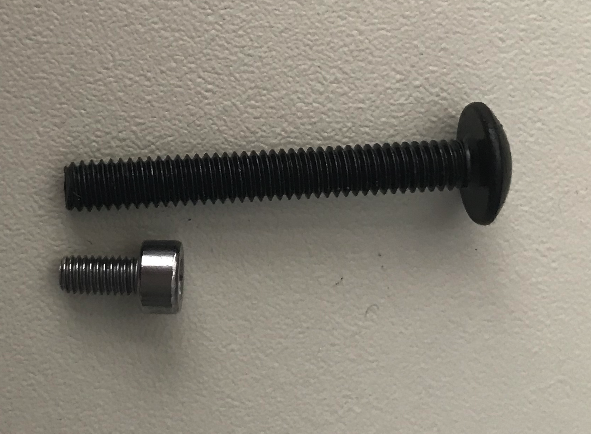

# Lessons Learned

Ok, here a list of some lessons I learned along the way:

## Custom Watercooling

Probably the best way to approach custom water-cooling is the following:

1. Inform yourself about Custom Watercooling \(obvious I know\)
2. Figure out how many radiators you will need for the build you would like to do. Size and thickness do matter, radiator thickness should be fine around 3 - 4 cm. Without overclocking one 120cm Radiator per component should be fine, with overclocking two. You can add more cooling to reduce noise due to fans.
3. Find a nice case which will fit your parts
4. Decide on which other parts you would want
5. Order case, motherboard, RAM, graphics card, reservoir, pump, radiators, and fans \(at least one per radiator plus one spare if you need to save a little bit of money in the beginning\)
6. Wait till all the stuff is there
7. Make sure that all radiators with fans mounted will fit the case together with the motherboard
8. Try to figure out where and how to position reservoir and pump
9. Try to envision how your tubes will flow \(no pun intended\)
10. Order rest of the parts included needed tubes and fittings

I personally did point 10 before I had the case which did lead to a lot of redesign and some after orders and returns mainly on for the fittings.

## Air Pressure Leak Testing

Air Pressure Testing is an easy and hassle free way to test if your build is leaking. I would still do a Wet Run in the end though.

* Get yourself an air pressure testing unit, either from EK or Aquacomputer, or build your own. 
* 15 Minutes without losing any air \(Do NOT use a high pressure to test\) means that normally the system is fine.
* Start Testing directly at the beginning with testing any component you want to use. 
* Get yourself a female / female extension or two to hook up to the tube and close it.
* During the building of the custom loop test those extensions to make sure they are safe.
* In the end do a final test of the full loop.

If air is leaking use some water with Dishwashing Liquid together with Q-Tips or similar to find any leaks.

Testing all components before you install them will help you around issues like I had where my reservoir was leaking at the top \(not really that important\). Hunting that down was quite a hassle, I did start "cutting" the loop in half and testing only that part. After I found the part which was losing air I "cut" that again and so on.

## The Theme for the Build

If you go for a black, white and some color theme and don't care which part has which color you are save, go ahead.

If you want something special be prepared to pay a lot of money, wait for ages, or be disappointed that the parts you want don't even exist.

Especially if you want to have colored parts for the custom water-cooling, make sure before going ahead that the provider of the parts you want to choose will support your theme. Also keep in mind that everybody seems to have a different definition of white, black, grey, red, and so on. So mixing and matching might not be possible.

## You need more time and parts than you think

Even if you plan ahead if you are not one of the specialized shops for custom water-cooling or creating time-lapsed youtube videos you will need additional time and parts.

I needed to buy additional screws to mount the reservoir mount to the radiator via the fans. 

Not only where the screws supplied with the mounts m3 and the radiator required m4, they were also quite short. I measured the original screws and they where 3 cm long. So I decided to buy 4 x 3.5 cm and 4 x 4 cm screws including some washers.

In the end, after drilling m4 holes into the mounts, I needed the 4 cm screws because they are resting on top of the mount, not internally. Sinking them isn't really an option because then I would need to use washers between mount and fans.

Oh and did I already say that the first shop I went to only had 4 cm screws and washers?

Similar did happen with the fittings and cables for the AquaComputer parts. I didn't notice when ordering that there were no connection cables between the pump, CPU cooler and flow meter to the aquaero supplied.

## Order of Assembly

The order of Assembly is quite important. Not in the obvious way like first the CPU into the CPU Socket and then the Cooler.

No, more in the way of figuring out the limiting factors first by doing a test positioning of components and then focussing on those limiting factors first.

So you put the cooler on the CPU but don't use the cooling paste yet, as we will remove it again.

So try to position all components and if you find limits during this part directly try to find a solution for them. 

Then with the components in place try to simulate cable and tube flow. Are the cables long enough? Will a tube kink? So make all of this work, either by repositioning the tubes and cables or by getting longer tubes and cables.

Also directly start looking for which part of tubing and cabling comes first, which after that, and so on.

And of course, you should now notice the hard spaces where you can't get to after you have put other things, might it be components, tubing or cabling in place.

Make yourself a list of steps with this information.

Did you find things that are questionable to implement?

Try them first, making sure that it will fit and work. Otherwise, think about a workaround or if possible just don't implement it. If you NEED to implement it, take a step back, and look at the issue again. Sometimes dropping some ideas will make it work. Sometimes putting things in different places or orientation will make it work. Sometimes the only way is to get a drill or saw out and remove parts of the case. And sometimes..... well....  you need to start from scratch and get a totally different component.

After you have done all this try it again. Again... nothing will be fully fixed now, just make sure it works.

Then you start the process for good. During all the following steps keep in mind the ordered list of steps you created so that you don't put yourself into a tight corner, there are enough already.

Put the thermal paste on the CPU and attach the cooler correctly. Start with the tubing and make sure that it can hold pressure.

Now attach all the cables. Keep in mind that labeled cables save you a lot of hassle in the long run.

Now do a test run WITHOUT the mainboard powered.

Now fill the system with coolant and let the cooling part run for some time.


Don't let your pump run dry.


Then you can finish the cabling and boot up your new computer.

## Corsair RMX 850 PSU

Lucky for Corsair that there aren't so many white PSU around, because their cables suck from a visual point of view. At least for the GPU and the mainboard. See my comments [here.](../build-log/assembling-the-build-1/side-compartment.md#power-cables)

So you can either spend more money by getting some custom made cables from for example CableMod or you do your own custom cables. I will do the later in the future and save atm the money.

## Spaghetti

Your case can never be big enough. I did choose the XL version because I did know that I needed the space for the water-cooled GPU \(most versions don't fit in the PCI slot in the smaller case\) and because of the size in general.

And with all the different components it still became a battle.

I think I did won though.

In the end, this get's me thinking though about the upcoming project to customize the cabling. For sure making customized cables for CPU / GPU / SATA power and Molex would help a lot with the too long or ugly looking cables.

All other cables though \(fans / RGB / etc\) would have a negative effect as the diameter of those cables would increase.

I'm looking forward to fans who have better cabling options \(like connectors at the fans, chaining etc\).

Truth to be told I wouldn't have those big issues if I would stay with Windows as support for Windows with software to control components is a lot better. And of course, without my RGB Lasershow it would have been a lot easier too. Or just go with normal chaining of the fans.

Using the Aquacomputer components adds a lot of complexity too, using a Bios managed approach with the help of some additional programs in Windows would have also made it easier.

Oh well, at least now I should have a fully customizable autonomous managed system.

