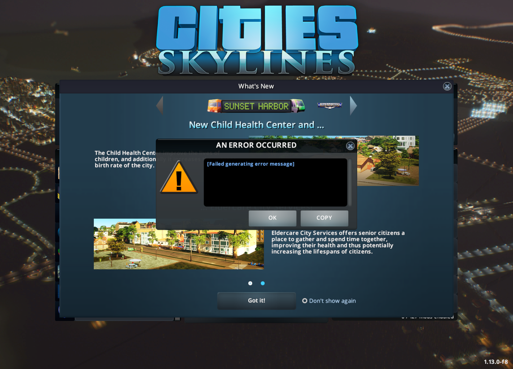

# Unable to Update Cities:Skylines in macOS Catalina

This is something that caused me some pain, especially as Steam Support can only post links to their FAQ as it seems.

But after trying my best Sherlock Holmes impression I got it solved.


## The Problem

Installing Cities:Skylines went fine and I could even start it, but it kept complaining about an update it wanted to do and a Disk Write Error.

```text
2020-05-14 10:36:47] [AppID 255710] Update canceled: Failed to write patch state file (Disk write failure) "/Volumes/The7Dwarfs/Games/steamapps/workshop/downloads/state_255710_255710_851382354.patch"
```

I looked around the internet and tried Steam Support, which wasn't helpful at all as they kept on quoting their troubleshooting FAQ and insisted it must be a hardware issue or something which could only be solved by a technician on my part.

Well of course there was an issue on my side, but other games installed fine. I even tried another new drive, I tried it on the boot device and I did any other thing I could think off.

But it looks like troubleshooting their product ends at supplying links to a FAQ if you use steam support instead of really solving the issue, and the problem is partly their issue.

## The hunt for the culprit

So I started hunting for more information. A disk write error can be caused by a lot of things especially if it is so un-descriptive.

I checked if the virus scan was the culprit or if perhaps the source \(not existing files\) was the issue, but nope.

I figured out that 255710 is the ID code for Cities:Skylines and I also figured out that [851382354](https://steamcommunity.com/sharedfiles/filedetails/?id=851382354) is an asset from the workshop. 

I deleted the cache etc and found now another file having issues, from asset 856897755, I asked the developer if he perhaps uses strange symbols, and he declined. I even unpacked the CRP file to take a look at my side if there is an issue. Nothing.

So I went the route to figure out if there was really an issue of the filesystem.

In macOS you can see which processes are accessing the filesystem with [opensnoop](https://ss64.com/osx/opensnoop.html).

```text
sudo opensnoop -ve -p STEAM PID
```

Will print out any errors caused by a program while accessing files.

So I let this run and tried updating again.

```text
2020 May 26 10:31:11   501   1866 steam_osx    2047   0 /Volumes/The7Dwarfs/Games/steamapps/workshop/downloads/state_255710_255710_851382354.patch
2020 May 26 10:31:12   501   1866 steam_osx     -1  24 /Volumes/The7Dwarfs/Games/steamapps/workshop/downloads/state_255710_255710_851381906.patch
```

-1 is an error and 24 is the description of that error. Let's take a [look ](http://www2.hs-fulda.de/~klingebiel/c-stdlib/sys.errno.h.htm)at it:

```text
#define	EMFILE	24	/* Too many open files			*/
```

Well, that is a lot more information just like Disk Write Error, isn't it?

So should I talk to steam support now and let them fix their program?

Well, I will give them a link to this webpage because I doubt it will be handled correctly. 

And I will also put a link in all of the threads I started so other people can solve the mystery.


## More background

Now the next search started, after figuring out that steam opens to many files during its update process,  how can you fix the issue?


BTW: I have LOT's of assets included in Cities:Skylines so I guess this is not a common issue.


So let's take a look into those open file limits first.

```text
sysctl kern.maxfiles
kern.maxfiles: 49152
```

That is the maximum files allowed \(I think at least\)

```text
sysctl kern.maxfilesperproc
kern.maxfilesperproc: 24576
```

The files per process, but there is more.

```text
ulimit -a
-t: cpu time (seconds)              unlimited
-f: file size (blocks)              unlimited
-d: data seg size (kbytes)          unlimited
-s: stack size (kbytes)             8192
-c: core file size (blocks)         0
-v: address space (kbytes)          unlimited
-l: locked-in-memory size (kbytes)  unlimited
-u: processes                       2784
-n: file descriptors                256
```

and there is

```text
launchctl limit
	cpu         unlimited      unlimited
	filesize    unlimited      unlimited
	data        unlimited      unlimited
	stack       8388608        67104768
	core        0              unlimited
	rss         unlimited      unlimited
	memlock     unlimited      unlimited
	maxproc     2784           4176
	maxfiles    256            unlimited
```

None of this maps in any way to the 2048 which would be the next successful file descriptor which opensnoop would return. BUT... that **maxfiles 256** is still the culprit. 


## Solving the riddle

Hunting through the internet provides lots of information on how to get rid of the "Too Many Files Open" issue.

One very good read and also useful is the answer on [apple.stackexchange.com](https://apple.stackexchange.com/questions/366187/why-does-setting-the-hard-limit-for-maxfiles-to-unlimited-using-launchctl-lim) 

That information comes in handy when you take a look at the solution, but there is more.

> Should I really fiddle around with a nice and working Hackintosh \(or macOS\) because of a game? What can happen in a worst case scenario? A lot....

So let's gather all the material from the crime scene and retreat back into the lab.

So I created a macOS VM \(which I wanted to do for testing nevertheless\) in[ VMware Fusion](https://www.vmware.com/products/fusion.html) and did take a closer look.

```text
sysctl kern.maxfiles
kern.maxfiles: 12288

sysctl kern.maxfilesperproc
kern.maxfilesperproc: 10240

ulimit -a
-t: cpu time (seconds)              unlimited
-f: file size (blocks)              unlimited
-d: data seg size (kbytes)          unlimited
-s: stack size (kbytes)             8192
-c: core file size (blocks)         0
-v: address space (kbytes)          unlimited
-l: locked-in-memory size (kbytes)  unlimited
-u: processes                       522
-n: file descriptors                256

launchctl limit
	cpu         unlimited      unlimited      
	filesize    unlimited      unlimited      
	data        unlimited      unlimited      
	stack       8388608        67104768       
	core        0              unlimited      
	rss         unlimited      unlimited      
	memlock     unlimited      unlimited      
	maxproc     522            1044           
	maxfiles    256            unlimited 
```

Well....


The VM only has 2 CPU kernels and 50 GB of harddrive space. So the values I showed you above might vary but the maxfiles is still 256


So from the stackexchange article above, we learned that we have a softlimit \(256\) and a hardlimit \(unlimited\) of maxfiles.

How do we change the value of 256 to a value which works? And will this fix the issue?


It will


So, let's install steam and then City:Skylines.


Result:   
  
Same issue, Disk Write Error when the Update is triggered. And again a "Too Many Open Files"


So we confirmed our suspicion: 

It has nothing to do with the system being a Hackintosh, the hardware, or the phase of the moon. And neither is the butler the murder.

## The hunt begins

Figuring out how to change that maximum open files in macOS Catalina is again not that easy, most of the information available is for Linux or older versions of macOS.

But truth behold there is something out [there.](https://gist.github.com/tombigel/d503800a282fcadbee14b537735d202c)

So let's try out the [comment ](https://gist.github.com/tombigel/d503800a282fcadbee14b537735d202c#gistcomment-3288161)to run it in Catalina \(which is really just the steps on how to get this load.sh created\).

After that, we restart the VM and take a look again at the values.

```text
sysctl kern.maxfiles       
kern.maxfiles: 524288

sysctl kern.maxfilesperproc
kern.maxfilesperproc: 524288

ulimit -a                  
-t: cpu time (seconds)              unlimited
-f: file size (blocks)              unlimited
-d: data seg size (kbytes)          unlimited
-s: stack size (kbytes)             8192
-c: core file size (blocks)         0
-v: address space (kbytes)          unlimited
-l: locked-in-memory size (kbytes)  unlimited
-u: processes                       2048
-n: file descriptors                524288

launchctl limit            
	cpu         unlimited      unlimited      
	filesize    unlimited      unlimited      
	data        unlimited      unlimited      
	stack       8388608        67104768       
	core        0              unlimited      
	rss         unlimited      unlimited      
	memlock     unlimited      unlimited      
	maxproc     2048           2048           
	maxfiles    524288         524288 
```

Also, there is the issue with:

```text
Before change:
sysctl kern.maxprocperuid
kern.maxprocperuid: 522

After change:
sysctl kern.maxprocperuid
kern.maxprocperuid: 2048
```

But is that an issue? 

Looks like it could be if you read this [answer.](https://apple.stackexchange.com/questions/296111/macos-sierra-ulimit-maxproc-only-2500)

So, because the issue is with the maximum open files I guess we should take a different approach.

Also what about the hardlimit of open files, it is not unlimited anymore? Remember the [link](unable-to-update-cities-skylines-in-macos-catalina.md#solving-the-riddle) I posted above? Does setting the hardlimit to 2147483647 solve our issue there?

```text
launchctl limit                                      
	cpu         unlimited      unlimited      
	filesize    unlimited      unlimited      
	data        unlimited      unlimited      
	stack       8388608        67104768       
	core        0              unlimited      
	rss         unlimited      unlimited      
	memlock     unlimited      unlimited      
	maxproc     2048           2048           
	maxfiles    524288         2147483647 
```

Oh well, and what about the side effects? What does our doctor tell us?

I tried running lsof in the VM but it didn't cause the issues described. But are we sure about the behavior in the long run?

So perhaps we could make this work temporarily? Would this work without changing **maxproc** ?

## Getting Closer

So let's see if the assumptions will hold up.

Running the following command in shell

```text
sudo launchctl limit maxfiles 524288 2147483647
```

will give you

```text
launchctl limit                                
	cpu         unlimited      unlimited      
	filesize    unlimited      unlimited      
	data        unlimited      unlimited      
	stack       8388608        67104768       
	core        0              unlimited      
	rss         unlimited      unlimited      
	memlock     unlimited      unlimited      
	maxproc     522            1044           
	maxfiles    524288         2147483647
```

Close steam, start steam, go do download, start update of Cities:Skylines.


Update is working! At least if you have more than 40GB of harddrive space in total 😀


A reboot will clear this value.

But now another issue creeps up. Paradox Launcher will complain to not have access to the game directory.


Is this important? I Don't know because afterward it was fine.

Started Cities: Skylines that came up with another error.



Is this important?

And how will the Paradox Launcher behave when I use 

```text
sudo launchctl limit maxfiles 524288 2147483647
```

Same behavior for the Paradox Launcher and Cities:Skylines.

So it looks like those errors are not based on the maxfiles value.


It could be that this is just missing file rights in general under Catalina which could be fixed with giving the apps the rights in System Preferences / Security.


## The solution

Final Verdict isn't in yet.

There are two options:

1\) keeping it temporary, so running the launchctl limit line every time I get the Disk Write Error again

2\) Using the approach from the gist to keep those settings permanently configured.

I have edited the original gist mentioned above to only change the values for maxfiles, you can find the gist [here.](https://gist.github.com/dredhorse/786e326aa7253fa31166e6f56855718a)


But I still haven't decided which option to use.


