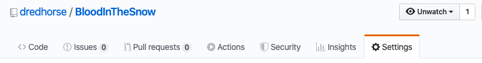
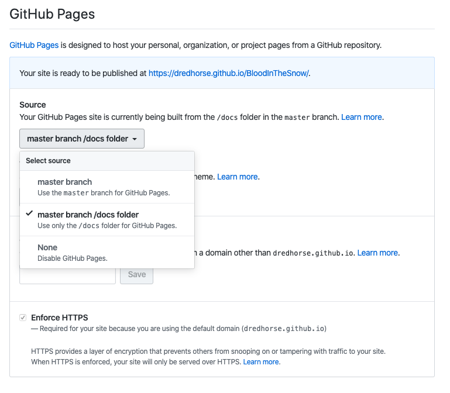
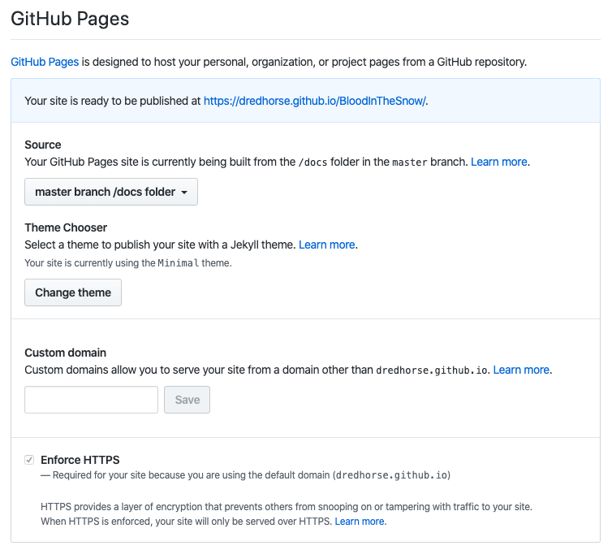

# Using gitbook to generate the documentation

## Installing gitbook-cli on OSX Catalina

There is a good documentation available on [GitHub](https://github.com/chusiang/how-to-build-the-gitbook-with-gitbook-cli)

but it is a little bit older so here are some additional steps you need to do.


There is also an issue with a lot of the features of the newer version of Gitbook. This is for example embedded URL or this Hint even. This will cause the cli version of gitbook to fail. For example  will cause Template render error: \( ..../SnowWhite/this-and-that/using-gitbook-to-generate-the-documentation.md\) \[Line 7, Column 2\] unknown block tag: embed make: _\*_ \[build\] Error 1


All in all I didn't pursue this further due to the above mentioned issues at the moment but I kept it here. It might be useful to others.

### Prerequisites

You need:

* Xcode
* brew
* git
* make

## Prepare Node Install

To be able to install npm and node you need to change some rights on the filesystem first:

```text
sudo chown -R $(whoami) /usr/local/share/man/man3 /usr/local/share/man/man5 /usr/local/share/man/man7
chmod u+w /usr/local/share/man/man3 /usr/local/share/man/man5 /usr/local/share/man/man7
```


brew will tell you that this is needed if you run it without these rights and you can just copy / paste it in the terminal if you want.


If you than run the install of npm and node you will find that node will not work afterwards as it requires access to /usr/local/include.

At least in my case the directory didn't exist so I created it and took over.

```bash
sudo mkdir /usr/local/include
sudo chown $(whoami) /usr/local/include
```

and than you can install node and npm

```bash
brew install node npm
```

So now you can start with gitbook-cli

## Gitbook-Cli Install

You start the installation with

```text
sudo npm install -g gitbook-cli
```

but you are not done yet.

Now you need to finish the gitbook install with

```text
gitbook install
```

After some time you can check with

```text
$ gitbook -V
CLI version: 2.3.2
GitBook version: 3.2.3
```

which version you have installed.

If you want to have epub, pdf etc versions of the documentation read further, if not jump ahead to [Creating the Documentation with a make file](https://app.gitbook.com/@dredhorse/s/blood-in-the-snow-a-hackintosh-story/~/drafts/-M4d23bzGDXB6sovi9aU/using-gitbook-to-generate-the-documentation#creating-the-documentation-with-a-make-file)

## Epub, PDF and mobi Versions

gitbook requires a commandline tool from [Calibre](https://calibre-ebook.com/download_osx) to create epub, pdf or mobi versions of the documentation.

Install Calibre after downloading it from above URL

Now link the ebook-convert tool to the right place

```text
ln -s /Applications/calibre.app/Contents/MacOS/ebook-convert /usr/local/bin/
```

## Creating the Documentation with a make file

If you use the make file which comes with this repo you can now do:

1. Build static HTML.

   ```text
    $ make
   ```

2. Build PDF.

   ```text
    $ make pdf
   ```

3. Build epub for iDevice.

   ```text
    $ make epub
   ```

4. Build mobi for Kindle.

   ```text
    $ make mobi
   ```

5. Review result at local.

   ```text
    $ make review
   ```

6. Clean the environment

   ```text
    $ make clean
   ```

## Configuring Github to show your documentation on Github Pages

And now we just need to configure Github to show the documentation on Github Pages.

Before you can configure github so, make sure that you already have a **/docs** folder in your repository.

Go to the Settings of your repository.



Now scroll down to Github Pages and select master branch /docs folder.



After that pick a theme you would like to use. I went with the minimal theme.



Now you should be able to publish your documentation to Github Pages.

